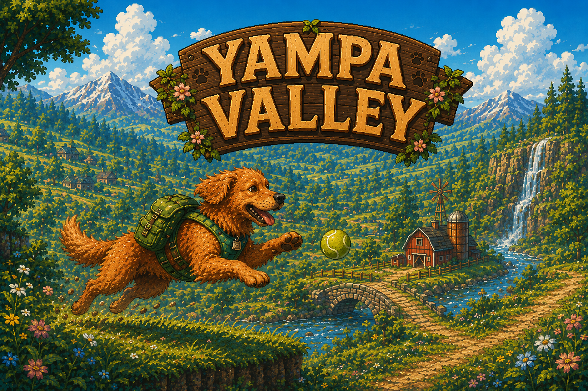

# Yampa Valley

A cozy single-level 2D platformer about a red-ish golden retriever sprinting
through a sun-bleached mountain valley, sliding on his momentum, splashing
through mud puddles, and gathering tennis balls. Plays in any modern browser
from a single HTML file.



## Run it

```bash
python3 -m http.server 8765
# then open http://localhost:8765/
```

That's it — no build step, no bundler. `index.html` loads `data.js` and the
sprite/audio files from `assets/`. Browsers will refuse to load audio from
`file://`, so you do need the local server.

## Controls

| Action | Keys |
|---|---|
| Move | ← / → · A / D |
| Jump | ↑ · W · Space |
| Roll | ↓ · S |
| Pause | Esc · P |
| Mute music | M |
| Choose difficulty | ← / → on title |
| Start / Restart | Enter · Space |

## Core mechanics

### Momentum

The dog accelerates and decelerates rather than snapping to top speed.
Releasing input applies friction, so he slides to a stop. Turning around at
high speed costs an extra deceleration term, so reversing direction feels
heavy — like the dog's paws have to scrabble against the ground.

All tuning lives in `data.js → player`:

| Field | Meaning |
|---|---|
| `acceleration` | px/s² added to vx per input frame |
| `maxRunSpeed` | clamped top horizontal speed |
| `friction` | px/s² removed when not pressing a direction |
| `airControl` | multiplier on accel/friction while airborne |
| `jumpVelocity` | initial vy at the start of a jump (negative = up) |
| `rollAccelerationBoost` | accel multiplier while rolling |
| `rollFriction` | low friction so a roll preserves speed |
| `rollMinSpeed` | floor on speed when entering a roll (gives a kick) |

### Jumping

Horizontal momentum is preserved while airborne. Landing on a chicken from
above stomps it. Air-control is reduced (`airControl: 0.45`) so jumps commit
to your launch trajectory.

### Rolling

Pressing **Down** curls the dog into a roll. While rolling:

- Friction is low — speed bleeds off slowly.
- Hitting a chicken from any side defeats it.
- Rolling through a mud patch grants the **mud shield** (see below).
- A short minimum duration prevents instant tap-cancels.

### Mud shield (binary)

Mud is **binary**, not a meter. Roll through a singular mud patch and you
become **muddy**. The HUD shows `MUD ✓ SHIELD` lit up.

- **Hit while muddy** → the mud cleans off, no knockback, no speed loss.
  The mud absorbed the hit. You keep running.
- **Hit while clean** → normal knockback and stun.

Mud patches are placed sporadically as **skill targets** — narrow (~90 px)
spots that require you to commit to a roll at the right moment. Each new
patch you gather counts toward a `+250` end-of-level bonus.

### Tennis balls

Bobbing collectibles, 100 pts each. They form arcs and trails that double
as path indicators:

- Low evenly-spaced rows → safe route
- Rising arcs → jump-timing hints
- Long horizontal trails → speed-run lines
- Isolated high balls → advanced route rewards

### Chickens

Walk a patrol back and forth on whatever platform they spawn on. Two ways
to defeat them, both worth 200 pts:

- **Stomp** from above (jump on top while falling).
- **Roll** into them.

Side contact while running upright triggers the hurt state — unless you
have the mud shield.

## Level structure

Each difficulty selects a **completely different level** — different terrain,
ball trails, mud patches and chicken placements. Levels live in
[`levels/easy.js`](levels/easy.js), [`levels/medium.js`](levels/medium.js),
and [`levels/hard.js`](levels/hard.js); `data.js` only carries tuning,
asset paths, and the difficulty-to-level mapping.

| Difficulty | World width | Terrain rects | Mud patches | Tennis balls (super) | Enemies | Mix | Feel |
|---|---|---|---|---|---|---|---|
| Easy   | 20 000 px | 25  |  3 | 107 (4)  |   7 | chickens only             | gentle intro to every mechanic |
| Medium | 40 000 px | 82  |  5 | 136 (5)  |  41 | chickens + cows           | denser platforms, heavier ground threats |
| Hard   | 80 000 px | 190 | 11 | 250 (8)  | 129 | chickens + cows + mushrooms | skyway jumps, mushroom-fast obstacles, 2× length |

Enemy roster (configs in `data.js → enemy`):

| Enemy | Width × Height | Speed | Patrol | Stomp pts | Notes |
|---|---|---|---|---|---|
| Chicken  | 60 × 56 |  55 px/s | ±80 px  | 200 | baseline patrol |
| Cow      | 86 × 68 |  35 px/s | ±100 px | 300 | big & slow — commit to the stomp |
| Mushroom | 50 × 52 |  80 px/s | ±65 px  | 250 | small & fast — easy to miss |

Every level follows the same six-section structure (per the
[design plan](yampa_valley_game_plan.md)) — Gentle Start, Momentum
Training, Mud Roll Zone, High-Speed Route, Enemy Challenge, Finish
Stretch — but the implementation of each section escalates with
difficulty (more platforms, tighter gaps, chickens perched on landing
platforms, denser mud-patch sequences).

## Scoring

The finish pane breaks the score into four scored components:

| Asset | Worth | Notes |
|---|---|---|
| Tennis balls | × 100 | tallied as you grab them |
| Enemies stomped | × 200 | jump-on-top or roll-into |
| Mud patches gathered | × 250 | one bonus per distinct patch rolled through |
| Time bonus | 15 × (200 − seconds) | every second under par (200 s) pays out, slower runs earn 0 |

Final score = sum of all four. The HUD's running score during play tracks
balls + stomps; mud and time bonuses are settled at the finish.

## Project layout

```
yampa_valley/
├── index.html              single-page game (canvas, physics, draw loop)
├── data.js                 tuning, difficulty mapping, asset/audio/parallax config
├── levels/
│   ├── easy.js             handcrafted 20 000 px world — gentle intro
│   ├── medium.js           20 000 px — denser platforms + chickens
│   └── hard.js             40 000 px — skyway jumps + frenzy enemies
├── assets/
│   ├── dog/                60 dog sprites — 6 states × 5 frames × clean+muddy
│   ├── enemies/            20 enemy sprites — 5 species, walk/defeated/taunt
│   ├── env/                11 environment sprites — tiles, tree, barn, finish, etc.
│   ├── backgrounds/        bg_panorama.png (seamlessly-looping painted panorama)
│   ├── ui/                 game_cover.png (title screen)
│   └── audio/              cabbage_sprint.mp3 (soundtrack)
├── tools/                  asset-pipeline scripts (Python + Pillow)
│   ├── slice.py            slices the three sprite sheets → individual PNGs
│   ├── process_panorama.py prepares new_background.png to loop seamlessly
│   └── analyze.py          one-off debug helpers
├── tests/                  Playwright-driven smoke test (see tests/README.md)
└── yampa_valley_game_plan.md  the design document this implementation follows
```

## Asset pipeline

The sprite sheets came in three combined PNGs (one per category) with text
labels and a beige reference background. The slicer in `tools/slice.py`:

1. **Dog sheet** — chroma-keys the beige background to transparent, detects
   the wood-grain grid lines by per-row/col alpha density, and cuts the
   13 × 6 grid into 60 individual transparent PNGs.
2. **Enemies sheet** — finds the thin orange table grid lines (dense
   single-pixel bands) and slices the 5-species × 4-action grid.
3. **Environment sheet** — irregular layout, so it uses connected-component
   labelling on the alpha channel with a near-neighbour merge pass, then
   names blobs by their (y-bucket, x) position.

Re-run any time you edit a sheet:

```bash
python3 tools/slice.py             # rebuild dog/enemy/env sprites
python3 tools/process_panorama.py  # rebuild the looping bg panorama
```

Both write into `assets/` and emit `assets/contact_sheet.png` as a debug
overview so you can eyeball the result.

## Tests

A real-browser smoke test lives in `tests/`. It boots a server, drives the
game with Playwright, asserts the dog moves/rolls/jumps/picks up balls, and
drops PNG screenshots. See [`tests/README.md`](tests/README.md).

